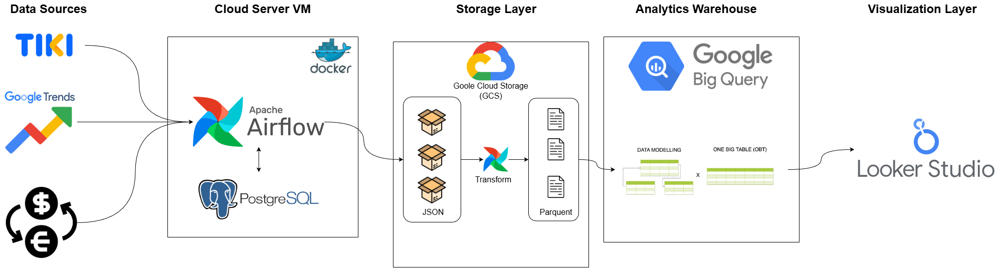
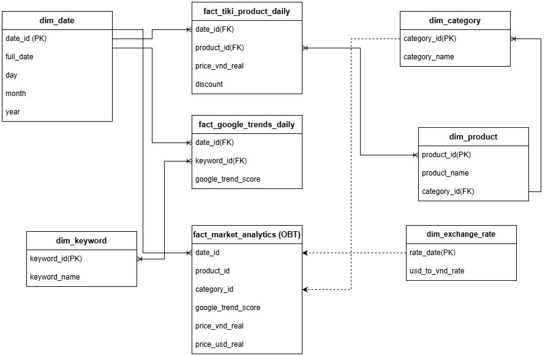

# Tiki E-commerce Analytics Platform

A production-grade data engineering project that builds an end-to-end analytics pipeline for Vietnam's leading e-commerce platform. The system crawls product data from Tiki.vn, enriches it with Google Trends and forex rates, and delivers business insights through Looker Studio dashboards.

---

## Table of Contents

- [Overview](#overview)
- [Architecture](#architecture)
- [Data Model](#data-model)
- [Features](#features)
- [Technology Stack](#technology-stack)
- [Project Structure](#project-structure)
- [Prerequisites](#prerequisites)
- [Installation](#installation)
- [Configuration](#configuration)
- [Usage](#usage)
- [DAG Workflows](#dag-workflows)
- [Future Enhancements](#future-enhancements)

---

## Overview

This project demonstrates a complete data engineering solution combining:

- **Web Crawling**: Automated product data extraction from Tiki.vn API
- **Data Lake Architecture**: Raw data storage in Google Cloud Storage with Hive partitioning
- **ETL Pipelines**: Orchestrated workflows using Apache Airflow
- **Data Warehouse**: Galaxy Schema design in BigQuery for analytical queries
- **Business Intelligence**: Interactive dashboards in Looker Studio

The pipeline processes daily snapshots of product listings across multiple categories, correlates them with market trends and currency rates, and produces a unified analytics layer for business decision-making.

---

## Architecture



The system follows a hybrid ETL + SQL Transformation pattern:

| Layer | Component | Technology |
|-------|-----------|------------|
| Ingestion | Tiki Crawler | Node.js + Puppeteer |
| Ingestion | Google Trends | Python + pytrends |
| Ingestion | FX Rates | Python + exchangerate-api |
| Storage | Data Lake | Google Cloud Storage |
| Transform | ETL Scripts | Python + Pandas + PyArrow |
| Orchestration | Workflow Manager | Apache Airflow 2.8.1 |
| Warehouse | Analytics Store | Google BigQuery |
| Presentation | Dashboards | Looker Studio |

**Data Flow**:
1. Crawlers extract raw data (JSON) and store in GCS with date partitioning
2. Transform scripts convert JSON to Parquet format with schema validation
3. BigQuery external tables map to GCS Parquet files
4. Staging tables receive new data via LOAD operations
5. MERGE/UPSERT patterns ensure idempotent loading to fact/dimension tables
6. Analytics layer (OBT) joins all dimensions for dashboard consumption

---

## Data Model



The warehouse implements a **Galaxy Schema (Fact Constellation)** combined with **One Big Table (OBT)** pattern:

### Fact Tables

| Table | Description | Grain |
|-------|-------------|-------|
| `fact_daily_snapshot` | Daily product metrics (price, rating, quantity sold) | Product x Date |
| `fact_google_trends` | Search interest scores by keyword and region | Keyword x Date |

### Dimension Tables

| Table | Description | Type |
|-------|-------------|------|
| `dim_products` | Product master data (name, brand, category) | Type 1 |
| `dim_categories` | Category hierarchy (L1, L2) | Type 0 |
| `dim_exchange_rate` | Daily currency exchange rates (USD/VND) | Type 0 |
| `dim_keyword_mapping` | Maps search keywords to product categories | Type 0 |

### Analytics Layer

| Table | Description |
|-------|-------------|
| `analytics_product_market_daily` | Pre-joined wide table for Looker Studio dashboards |

### Category and Keyword Mapping


The mapping table connects Google Trends keywords to Tiki product categories, enabling correlation analysis between search interest and sales performance.

---

## Features

- **Idempotent Pipelines**: All DAGs use MERGE/UPSERT patterns preventing duplicate data
- **Anti-Block Protection**: Smart delay and retry logic for Google Trends API
- **Hive Partitioning**: Efficient date-based data organization in GCS
- **Schema Validation**: PyArrow enforces data types during transformation
- **Configurable Environment**: All sensitive values externalized to environment variables
- **Docker Deployment**: Single-command infrastructure setup
- **Incremental Processing**: Only new data is processed each run
- **Error Recovery**: Automatic retry with exponential backoff

---

## Technology Stack

### Infrastructure
- Docker & Docker Compose
- Apache Airflow 2.8.1
- PostgreSQL 13 (Airflow metadata)

### Data Processing
- Python 3.8
- Pandas
- PyArrow
- google-cloud-bigquery
- google-cloud-storage

### Web Crawling
- Node.js 20
- Puppeteer 24
- Axios

### Cloud Services
- Google Cloud Storage
- Google BigQuery
- Looker Studio

---

## Project Structure

```
ETL/
├── dags/                           # Airflow DAG definitions
│   ├── tiki_dag.py                 # Tiki product data pipeline
│   ├── trends_dag.py               # Google Trends pipeline
│   ├── fx_rate_dag.py              # Currency exchange rate pipeline
│   └── analytics_dag.py            # OBT transformation pipeline
├── TikiCrawler/
│   └── puppeteer/
│       ├── src/
│       │   ├── api_crawler.js      # Tiki API extraction logic
│       │   ├── config.js           # Crawler configuration
│       │   ├── gcs.js              # GCS upload utilities
│       │   └── utils.js            # Helper functions
│       └── package.json
├── TikiTransform/
│   └── scripts/
│       ├── transform_tiki.py       # Tiki JSON to Parquet
│       ├── transform_google_trends.py
│       ├── transform_fx_rate.py
│       └── load_to_bq.py           # BigQuery loading utilities
├── scripts/
│   ├── insert_dim_categories.sql   # Dimension seeding
│   └── fix_keyword_mapping.sql     # Mapping corrections
├── docker-compose.yaml             # Multi-container orchestration
├── Dockerfile                      # Airflow custom image
├── requirements.txt                # Python dependencies
├── bigquery_schema.sql             # DDL for all tables
└── .env.example                    # Environment template
```

---

## Prerequisites

- Docker Desktop 4.x+
- Google Cloud Platform account
- GCP Service Account with roles:
  - BigQuery Data Editor
  - BigQuery Job User
  - Storage Object Admin

---

## Installation

1. **Clone the repository**

```bash
git clone https://github.com/yourusername/tiki-analytics-platform.git
cd tiki-analytics-platform
```

2. **Create environment file**

```bash
cp .env.example .env
```

3. **Configure environment variables**

Edit `.env` with your GCP credentials:

```env
GCP_PROJECT_ID=your-gcp-project-id
GCS_BUCKET_NAME=your-gcs-bucket
GCP_DATASET=your_bigquery_dataset
AIRFLOW_UID=50000
```

4. **Place GCP credentials**

Copy your service account JSON file to the project root:

```bash
cp /path/to/your-credentials.json ./google_cloud_credentials.json
```

5. **Initialize BigQuery schema**

Run the DDL script in BigQuery console or via bq CLI:

```bash
bq query --use_legacy_sql=false < bigquery_schema.sql
```

6. **Start the services**

```bash
docker-compose up -d
```

7. **Access Airflow UI**

Navigate to `http://localhost:8080`

Default credentials: `airflow` / `airflow`

---

## Configuration

### Environment Variables

| Variable | Description | Required |
|----------|-------------|----------|
| `GCP_PROJECT_ID` | Google Cloud project ID | Yes |
| `GCS_BUCKET_NAME` | GCS bucket for raw data | Yes |
| `GCP_DATASET` | BigQuery dataset name | Yes |
| `GCP_CREDENTIALS_PATH` | Path to service account JSON | Yes |
| `AIRFLOW_UID` | Airflow user ID (Linux) | No |

### Crawler Configuration

Edit `TikiCrawler/puppeteer/src/config.js` to modify:

- Target categories
- Page limits
- Request delays
- Output paths

---

## Usage

### Manual DAG Trigger

1. Open Airflow UI at `http://localhost:8080`
2. Enable the desired DAG
3. Click "Trigger DAG" button

### CLI Trigger

```bash
docker exec -it etl-airflow-scheduler-1 airflow dags trigger tiki_dag
```

### View Logs

```bash
docker-compose logs -f airflow-scheduler
```

---

## DAG Workflows

### tiki_dag (Daily at 06:00 UTC)

1. `run_crawler` - Execute Node.js API crawler
2. `transform_to_parquet` - Convert JSON to Parquet
3. `load_to_staging` - Load Parquet to BigQuery staging
4. `merge_to_fact` - MERGE into fact_daily_snapshot
5. `update_dimensions` - Refresh dim_products

### trends_dag (Daily at 08:00 UTC)

1. `fetch_trends` - Query Google Trends API with anti-block protection
2. `transform_trends` - Normalize and convert to Parquet
3. `load_staging` - Load to staging_google_trends
4. `merge_fact` - MERGE into fact_google_trends

### fx_rate_dag (Daily at 07:00 UTC)

1. `fetch_rates` - Query exchange rate API
2. `transform_rates` - Process and validate
3. `load_dim` - UPSERT to dim_exchange_rate

### analytics_dag (Daily at 10:00 UTC)

1. `refresh_obt` - DELETE-INSERT pattern to rebuild analytics_product_market_daily
2. Joins all fact and dimension tables
3. Calculates derived metrics (price changes, trend correlations)

---

## Future Enhancements

### 1. Intersection Mapping (Deep-dive Granularity)

**Problem**: Current keyword mapping is overly broad. For example, all Samsung products map to the "Samsung" trend keyword, causing Samsung refrigerators to incorrectly correlate with smartphone trends.

**Solution**: Implement intersection-based mapping logic.

**Formula**: `Trend Keyword = Brand + Category`

**Example**:
- Product: "Samsung Galaxy S23"
- Category: "Smartphones"
- Result: Map to "Samsung Galaxy" keyword
- Product: "Samsung Refrigerator"
- Category: "Home Appliances"
- Result: Map to "Samsung Home Appliances" keyword

**Implementation**:
```sql
CASE
    WHEN category_name = 'Smartphones' AND product_name LIKE '%Samsung%' 
        THEN 'Samsung Galaxy'
    WHEN category_name = 'Laptops' AND product_name LIKE '%Apple%' 
        THEN 'MacBook'
    WHEN category_name = 'Home Appliances' AND product_name LIKE '%Samsung%' 
        THEN 'Samsung Home Appliances'
END AS trend_keyword
```

**Impact**: Eliminates cross-category noise, provides precise trend correlation for specific product lines.

---

### 2. AI-Powered Keyword Coverage Expansion

**Problem**: Current manual mapping covers only 35% of core products (Laptops, Phones). The remaining 65% of long-tail products (phone cases, cables, accessories) are unmapped or defaulted to "Others".

**Solution**: Integrate Large Language Models (LLMs) into Airflow pipeline for automatic keyword generation.

**Architecture**:
```
dim_products → Python Operator (LLM API) → Auto-generated Keywords → dim_keyword_mapping
```

**Workflow**:
1. Extract unmapped products from `dim_products`
2. Send product name + category to Gemini/OpenAI API
3. Prompt: "Given product '{name}' in category '{category}', suggest Google Trends keyword"
4. Store AI-generated mappings in `dim_keyword_mapping`
5. Flag mappings with `mapping_source = 'AI'` for quality review

**Example API Call**:
```python
prompt = f"""
Product: {product_name}
Category: {category_name}
Task: Suggest a Google Trends keyword that best represents this product for market analysis.
Output: Single keyword phrase (2-3 words max)
"""
keyword = gemini_api.generate(prompt)
```

**Impact**: Increase keyword coverage from 35% to 90%, automate tedious manual mapping, enable trend analysis for long-tail products.

**Cost Consideration**: Implement caching and batch processing to minimize API costs (estimated ~$5/month for 1000 products).

---

## Contact

**Email**: jennifermv33@gmail.com

---

**Copyright © 2026. All Rights Reserved.**

This project is for educational and portfolio purposes only.
